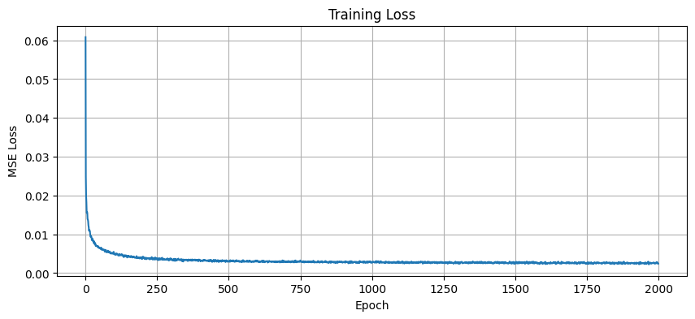
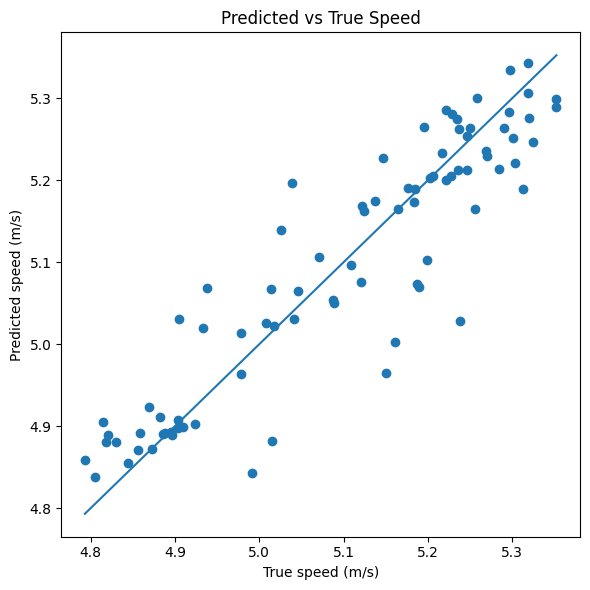
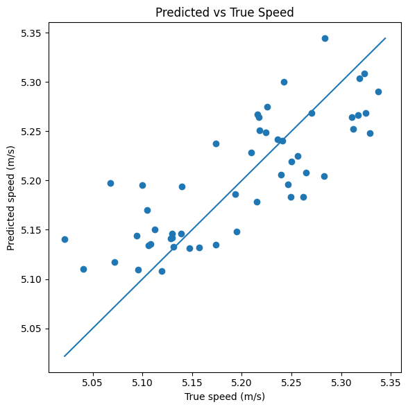
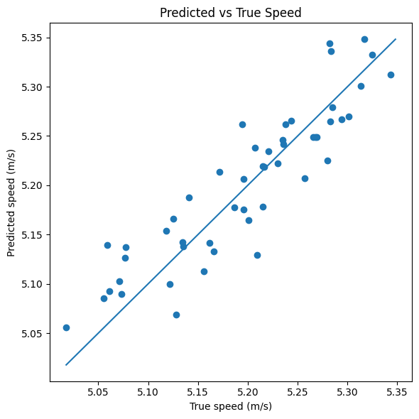

# RowingSpeedPredictor

## Installation

To install the required dependencies, run:

```bash
pip install -r requirements.txt
```
# Rowing Speed Prediction from Per-Stroke Telemetry Data  
**Author:** Nate Ly  
**Date:** May 4, 2025  

## Introduction

In competitive rowing, the goal is to travel a distance of 2000 meters as fast as possible. The fastest boat, called an Eight, has eight rowers and a coxswain. Boat speed comes from a combination of power output from the athletes and technical cohesion. While maximizing power output relies on training the human body to its physiological limits, technical cohesion depends on neuromuscular synchronization and practice. Although sports science has made great strides in optimizing human physiology through training and nutrition, rowing technique remains the a bottleneck of boat speed.

Traditional fluid-dynamics models can predict boat motion, but they require extreme care in specifying boundary conditions and are computationally expensive. Moreover, they cannot capture human variability due to fatigue or subtle technical differences. A data-driven approach “prices in” these unmodeled factors, offering not only a cheaper but potentially more practical and insightful method.

**General Approach:**  
- Collect per-stroke data through special oarlocks equipped with strain gauges.  
- Clean and filter the data to retain only “quality” strokes—i.e., when all eight rowers are rowing with intent and the boat is neither spinning nor drilling.  
- Train a neural network to map the extracted features to boat speed.  

**Challenges:**  
- The telemetry oarlocks are in beta testing, endure substantial and repetitive strain, and are calibrated by hand, which can introduce skew.  
- Determining the best method to filter for “quality” strokes.  
- Tuning machine-learning hyperparameters to optimize loss and generalization.  

## Data

The data were collected from Yale Heavyweight Crew on April 7, 2025, using telemetry from two Eights, with the written permission of all 16 rowers and the head coach. Each per-stroke record includes:

- Power (W)  
- Rate (strokes per minute)  
- Work (J)  
- Blade angles: catch angle, slip, wash, finish angle, connected length (degrees)  
- Peak force angle (degrees)  
- Catch time, stroke duration (seconds)  

The target variable, boat speed (m/s), was measured via GPS.

## Methodology

### Problem Formulation

Let each stroke be represented by a feature vector \(\mathbf{x}\in\mathbb{R}^d\) and its measured speed by \(y\in\mathbb{R}\). Introduce a fixed offset \(b_0\in\mathbb{R}\) to account for baseline speed. We then learn a residual function

$$
g: \mathbb{R}^d \;\to\; \mathbb{R}
$$

such that

$$
g(\mathbf{x}) \approx y - b_0.
$$

The full predictor is

$$
\hat y = g(\mathbf{x}) + b_0.
$$

### Model Architecture

We implement a feed-forward neural network in PyTorch with four fully connected layers and ReLU activations. The layer dimensions are \(d \to 64 \to 32 \to 16 \to 1\). Let \(\mathbf{h}^{(0)}=\mathbf{x}\). Then for \(i=1,2,3\):

$$
\begin{aligned}
\mathbf{z}^{(i)} &= w^{(i)}\,\mathbf{h}^{(i-1)} + \mathbf{b}^{(i)},\\
\mathbf{h}^{(i)} &= \mathrm{ReLU}(\mathbf{z}^{(i)}).
\end{aligned}
$$

$$
\mathbf{z}^{(4)} = w^{(4)}\,\mathbf{h}^{(3)} + b^{(4)}, 
\quad
\hat y = \mathbf{z}^{(4)}.
$$

### Loss Function and Optimization

We aim to minimize the Mean Squared Error over \(N\) strokes:

$$
\mathcal{L}(\theta)
= \frac{1}{N}\sum_{i=1}^N \bigl(f(\mathbf{x}_i) - y_i\bigr)^2.
$$

Gradients are computed via back-propagation and weights are adjusted using PyTorch’s Adam optimizer.

## Implementation

### Data Processing

To retain only quality strokes, any strokes below a certain speed were filtered out. We also computed per-crew variance features and applied cube-root transforms to power and work metrics.

### Parameters

- **Minimum Speeds:** 4.75, 5 m/s  
- **Epochs:** 2000  
- **Weight Decay:** \(1\times10^{-7}\)  
- **Learning Rate:** \(5\times10^{-4}\)  
- **Batch Size:** 16  
- **Momentum:** N/A (using default Adam with \(\beta_1=0.9,\,\beta_2=0.999\))  
- **Dropout Rate:** 0.2  
- **Training Split:** 80% train / 20% test  

## Results

The original goal was to predict speed of “at-pace” or hard rowing strokes to within 1 s/500 m, around a 1% mean absolute percent error.

Below is a reference chart for different rowing speeds and relative efforts:

| Speed (m/s) | Pace per 500 m | Intensity          |
|------------:|---------------:|--------------------|
| 4.50        | 1:51.1         | Low                |
| 4.75        | 1:45.0         | Steady State       |
| 5.00        | 1:40.0         | Medium rowing      |
| 5.25        | 1:35.0         | Hard rowing        |
| 5.50        | 1:31.0         | Around Race Effort |

### Minimum Speed of 4.75 m/s

Filtering out any non-“quality” strokes (slower than a 1:45 pace), we obtain:

| Metric                   | Value  |
|--------------------------|-------:|
| Number of data points    | 1678   |
| MSE                      | 0.0048 |
| R² score                 | 0.8261 |
| MAPE                     | 1.02%  |
| Split error over 500 m   | 1.00 s |

  
*Figure: MSE Loss vs. Epochs*

  
*Figure: Predicted vs True Speed for strokes above 4.75 m/s*

### Minimum Speed of 5 m/s

Restricting strokes to moderate effort or above reduces noise further while still capturing hard-effort data:

| Metric                   | Value  |
|--------------------------|-------:|
| Number of data points    | 1057   |
| MSE                      | 0.0017 |
| R² score                 | 0.7511 |
| MAPE                     | 0.68%  |
| Split error over 500 m   | 0.65 s |

  
*Figure: Predicted vs True Speed for strokes above 5 m/s*

### With Previous Stroke Speed

Adding the prior stroke’s speed shifts features to capture speed deltas:

| Metric                   | Value  |
|--------------------------|-------:|
| Number of data points    | 1055   |
| MSE                      | 0.0013 |
| R² score                 | 0.8056 |
| MAPE                     | 0.53%  |
| Split error over 500 m   | 0.56 s |

  
*Figure: Predicted vs True Speed for strokes above 5 m/s with previous stroke speed*

## Conclusion

In conclusion, we achieved our goal of predicting boat speed to under a 1-second split error over 500 m. By filtering the data and engineering key features, our neural network delivered strong performance. Future work could include grid-search hyperparameter tuning and collecting more varied data to guard against overfitting.  
